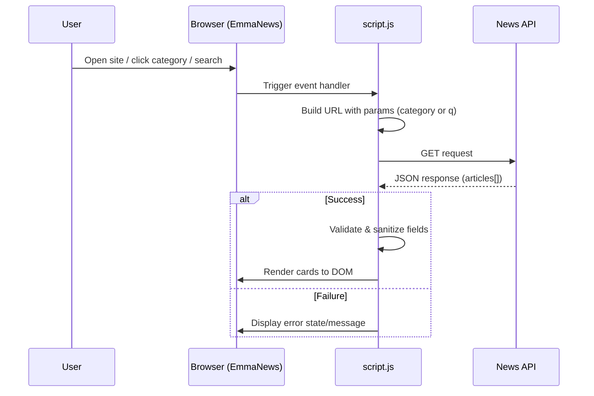

# EmmaNews API Structure (Man Folder)

This document illustrates how the API flow works for the static website in `Man/` (EmmaNews/TechNews-style implementation).

## 1) High-Level API Flow

```mermaid
flowchart TD
    U[User Opens EmmaNews in Browser] --> H[index.html loads]
    H --> J[script.js initializes]
    J --> C{Action Type}

    C -->|Initial Load| R1[Build request for top/general headlines]
    C -->|Category Click| R2[Build request with selected category]
    C -->|Search Submit| R3[Build request with query keyword]

    R1 --> F[fetch() call to News API endpoint]
    R2 --> F
    R3 --> F

    F --> N[(News API Service)]
    N --> P{HTTP Response}

    P -->|200 OK + articles| D[Normalize/validate response data]
    D --> M[Map articles to UI card model]
    M --> V[Render article cards in DOM]

    P -->|Error status / malformed data| E[Show error message in UI]
    P -->|Network failure| E

    E --> X[User retries via category/search/refresh]
```

---

## 2) Component-Level Structure

```mermaid
flowchart LR
    A[index.html] --> B[style.css]
    A --> C[script.js]

    C --> D[UI Event Handlers\n- category buttons\n- search form\n- refresh triggers]
    C --> E[Request Builder\n(endpoint + params + API key)]
    C --> F[Data Fetch Layer\nfetch/async-await]
    C --> G[Response Guard\nstatus checks + null checks]
    C --> H[Renderer\narticle cards + metadata]
    C --> I[State/UX\nloading, error, empty states]

    F --> J[(News API)]
    J --> F
```

---

## 3) Request/Response Sequence



---

## 4) Why this structure is suitable for a static website

- No backend is required to serve dynamic content from the API.
- Fast iteration: UI and API integration live in the same frontend codebase.
- Easy deployment on static hosting (GitHub Pages, Netlify, Vercel static, etc.).

---

## 5) Important Note (Security)

Because this is a static site, any API key in client-side JavaScript is visible to end users.

Recommended improvement for production:

1. Move API calls behind a lightweight backend/proxy.
2. Store API key in server environment variables.
3. Add server-side rate limiting and caching.
